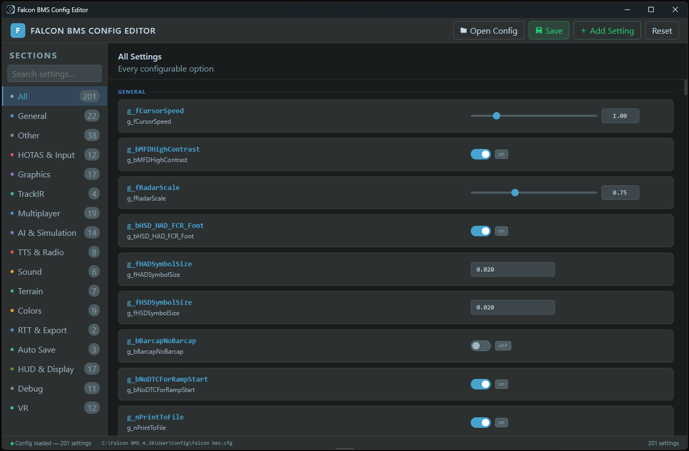

# Falcon BMS Config Editor

A desktop app built with **Tauri** (Rust + HTML/JS) for editing `falcon bms.cfg` files through a clean GUI.



## Prerequisites

1. **Rust** - https://rustup.rs
   ```
   curl --proto '=https' --tlsv1.2 -sSf https://sh.rustup.rs | sh
   ```

2. **Node.js** (v18+) - https://nodejs.org

3. **Tauri system dependencies** (Windows: none extra needed; Linux: see below)
   - Linux: `sudo apt install libwebkit2gtk-4.0-dev build-essential libssl-dev libgtk-3-dev libayatana-appindicator3-dev librsvg2-dev`

---

## Setup & Run

[**Download Current Release (v0.1.0)**](https://github.com/Spearhead2/Falcon-BMS-config-editor/releases/tag/v0.1.0)

or 

```bash
# Clone / unzip the project, then:
cd falcon-bms-config

# Install JS dependencies
npm install

# Build a release binary
npm run build
# Output: src-tauri/target/release/falcon-bms-config(.exe)

# To run in development mode (hot reload)
npm run dev
```

---

### Control types
- **Toggles** - on/off for boolean (0/1) settings
- **Sliders** - range sliders with numeric input for bounded values
- **Selects** - dropdowns for enum settings (VR mode, anisotropic, etc.)
- **Color pickers** - native color picker + hex input, auto-converts BMS BGR/ABGR format
- **Text inputs** - free-form for string settings

### Modified tracking
Settings you've changed are highlighted in amber. A count of modified settings appears in the header. Click **Reset** to undo all unsaved changes.

---

## Extending the App

### Adding a new setting
1. Open `src/js/schema.js`
2. Find the `const SCHEMA = {` block
3. Add an entry:
   ```js
   g_myNewSetting: { type: 'toggle', section: 'General' },
   // or
   g_myFloatSetting: { type: 'range', min: 0, max: 1, step: 0.1, section: 'Graphics' },
   ```
That's it - the UI builds itself from the schema.

### Modifying the Rust backend
The parser in `main.rs` handles:
- `set KEY VALUE // comment` format
- Quoted string values (`"..."`)
- Inline `//` comments (aware of quoted strings so won't split inside them)
- Non-destructive writes (preserves all comments, blank lines, section headers)
